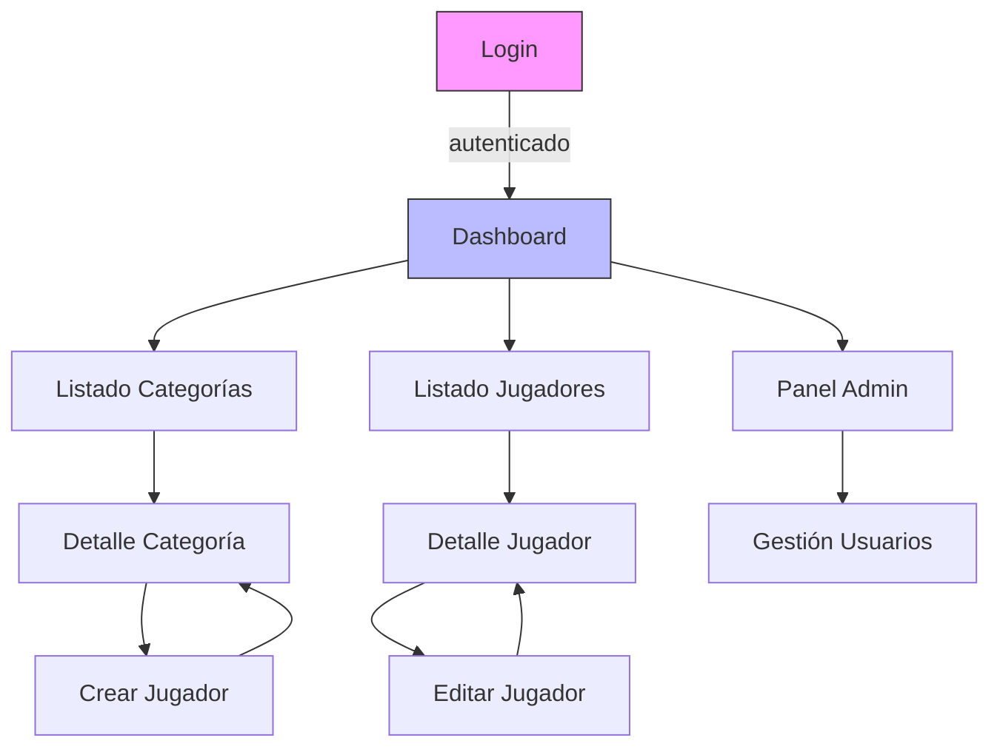

# Diagrama de navegación

Descripción
- Diagrama de flujo de pantallas de alto nivel que muestra navegación principal entre vistas de la aplicación.

Diagrama (Mermaid)

Rutas sugeridas (RESTful / SPA)
- /login
- /dashboard
- /categorias
- /categorias/{id}
- /categorias/{id}/crear-jugador
- /jugadores
- /jugadores/{id}
- /jugadores/{id}/editar
- /admin/usuarios

Navegación y contexto
- Desde cualquier detalle se debe poder volver a la lista padre (breadcrumb).
- Mantener parámetros de búsqueda/paginación al volver a listados (query params: page, size, search).
- Deep linking: cada vista debe tener URL propia para compartir/guardar.

Flujos críticos de usuario
- Crear Jugador: /jugadores/new → POST → /jugadores/{id} (o volver a listado con highlight)
- Asignar Jugador a Categoría: desde detalle de categoría → modal crear jugador o formulario inline

Notas
- El diagrama es de alto nivel; para pantallas complejas crear diagramas de flujo específicos por feature.