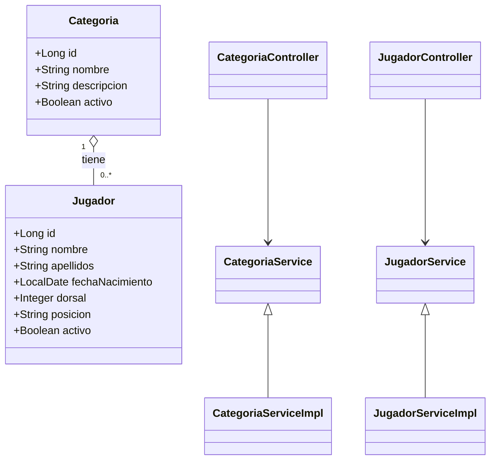

# Paquetes, Interfaces y Clases — Diseño de la aplicación

Objetivo
- Proporcionar una visión del packaging, las interfaces clave y las clases principales del backend (Java / Spring Boot). Este documento agrupa Paquetes / Interfaces / Clases para facilitar la comprensión y mantenimiento.

1. Estructura de paquetes propuesta (convencional)
- com.escuela.api
  - config
  - controller
  - dto
  - service
  - service.impl
  - repository
  - model (o entity)
  - mapper
  - exception
  - security
  - util
  - dto.mapper (opcional: mappers automáticos)

Ejemplo de árbol:
- com.escuela.api.controller
  - CategoriaController.java
  - JugadorController.java
- com.escuela.api.service
  - CategoriaService.java (interface)
  - JugadorService.java (interface)
- com.escuela.api.service.impl
  - CategoriaServiceImpl.java
  - JugadorServiceImpl.java
- com.escuela.api.repository
  - CategoriaRepository.java (extends JpaRepository<Categoria, Long>)
  - JugadorRepository.java
- com.escuela.api.model
  - Categoria.java (@Entity)
  - Jugador.java (@Entity)
- com.escuela.api.dto
  - CategoriaDTO.java
  - JugadorDTO.java
  - CreateJugadorRequest.java
- com.escuela.api.mapper
  - CategoriaMapper.java (MapStruct) / CategoriaMapperImpl
  - JugadorMapper.java

2. Interfaces clave (firmas y responsabilidades)
- CategoriaService
  - List<CategoriaDTO> findAll();
  - CategoriaDTO findById(Long id);
  - CategoriaDTO create(CategoriaDTO dto);
  - CategoriaDTO update(Long id, CategoriaDTO dto);
  - void delete(Long id);

- JugadorService
  - List<JugadorDTO> findAll(Pageable p, Optional<Long> categoriaId, Optional<Boolean> activo);
  - JugadorDTO findById(Long id);
  - JugadorDTO create(CreateJugadorRequest req);
  - JugadorDTO update(Long id, JugadorDTO dto);
  - void delete(Long id);

- Repositorios (Spring Data)
  - interface CategoriaRepository extends JpaRepository<Categoria, Long> { Optional<Categoria> findByNombre(String nombre); }
  - interface JugadorRepository extends JpaRepository<Jugador, Long> { List<Jugador> findByCategoriaId(Long categoriaId); }

3. Clases principales y relaciones (UML simplificado)
- Mermeid classDiagram:


4. DTOs y mappers
- Razonamiento:
  - Separar entidad / persistencia de la representación en la API.
  - Evitar exponer campos sensibles o detalles de JPA.
- Ejemplos:
  - CategoriaDTO { id, nombre, descripcion, activo }
  - JugadorDTO { id, nombre, apellidos, fechaNacimiento, dorsal, posicion, categoriaId }
- Mapper recomendado: MapStruct (o ModelMapper). Definir interfaces y generar implementación en build.

5. Controladores (contratos REST)
- Patrón RESTful por recursos:
  - CategoriaController
    - GET /api/v1/categorias
    - GET /api/v1/categorias/{id}
    - POST /api/v1/categorias
    - PUT /api/v1/categorias/{id}
    - DELETE /api/v1/categorias/{id}
  - JugadorController
    - GET /api/v1/jugadores
    - GET /api/v1/jugadores/{id}
    - POST /api/v1/jugadores
    - PUT /api/v1/jugadores/{id}
    - DELETE /api/v1/jugadores/{id}

6. Manejo de excepciones
- Paquete: exception
  - NotFoundException, BadRequestException, ConflictException
  - GlobalExceptionHandler (@ControllerAdvice) → mapear códigos HTTP y estructura de error consistente:
    ```json
    { "timestamp": "...", "status": 404, "error": "Not Found", "message": "Categoria no encontrada", "path": "/api/v1/..." }
    ```

7. Seguridad (esquema)
- Paquete: security
  - JwtTokenProvider, JwtAuthFilter, SecurityConfig
  - Roles: ROLE_USER, ROLE_ADMIN
  - Anotaciones: @PreAuthorize("hasRole('ADMIN')") en endpoints críticos

8. Tests y utilidades
- Paquete: test / util
  - Factories/TestBuilders para crear entidades en pruebas.
  - Utilidades para conversiones de fecha, validaciones comunes.

9. Consideraciones de diseño y extensibilidad
- Separación de capas (controller → service → repository) para testabilidad.
- Interfaces para servicios para facilitar mocks y pruebas unitarias.
- DTOs y mappers para evolucionar API sin afectar entidades.
- Repositorios con queries parametrizados y paginación desde el inicio.

10. Siguientes pasos (implementación)
- Revisar código actual para alinear nombres de paquetes y clases con este diseño.
- Generar diagramas UML completos (Herramienta: PlantUML) si se necesita documentación gráfica más detallada.
- Crear plantilla de clase/interface en repo (boilerplate) y añadir tests iniciales para cada capa.