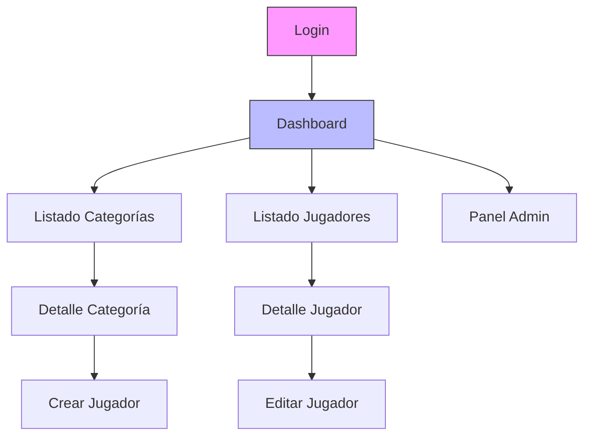

# Diseño GUI (Interfaz de Usuario)

Resumen
- Objetivo: describir vistas, flujos y pautas de interacción para la aplicación API (consumida por cliente web o móvil).
- Alcance: UI (vistas), UX (usabilidad), IxD (interacción), Diagrama de navegación y Reutilización de componentes.

1. UI — Vistas (lista y descripción)
- Login
  - Campos: usuario/email, contraseña.
  - Acciones: Iniciar sesión, Recuperar contraseña.
  - Mensajes: errores de validación, bloqueo por credenciales inválidas.

- Dashboard / Home
  - Resumen con KPIs: número total de categorías, jugadores activos, actividad reciente.
  - Acciones rápidas: Crear categoría, Crear jugador, Buscar jugador.

- Listado de Categorías
  - Tabla o cards con: nombre, descripción, nº jugadores, acciones (ver, editar, eliminar).
  - Filtros: activo/inactivo, búsqueda por nombre.
  - Paginación y ordenación.

- Detalle Categoría
  - Información de la categoría y listado paginado de jugadores pertenecientes.
  - Acciones contextuales: añadir jugador a categoría, editar categoría.

- Listado de Jugadores
  - Tabla con: nombre, apellidos, dorsal, posición, categoría, fecha alta, acciones.
  - Filtros: categoría, posición, activo, búsqueda por nombre.
  - Soporte de paginación y selección múltiple.

- Detalle Jugador / Editar Jugador
  - Formulario con validación en cliente (y mensajes de error devueltos por la API).
  - Campos clave: nombre, apellidos, fecha de nacimiento (datepicker), dorsal (num), posición (select), categoría (select).

- Formulario Crear/Editar (modal o página)
  - Validaciones inline, botón Guardar/Cancelar.
  - Indicadores de carga y mensajes de éxito/error.

- Panel de Administración / Usuarios (si aplica)
  - Gestión de roles, permisos y auditoría.

2. UX — Principios de usabilidad
- Consistencia: mismas acciones y patrones visuales en vistas semejantes (botones, iconos, colores).
- Visibilidad del estado: mostrar feedback inmediato (spinners, toasts, banners).
- Prevención de errores: confirmaciones en eliminaciones, validaciones preventivas.
- Minimizar carga cognitiva: presentar la información esencial primero (principio de “progressive disclosure”).
- Accesibilidad: cumplir WCAG básico (contraste, etiquetas ARIA en formularios, navegación por teclado).
- Móvil primero / responsive: diseños que funcionen en pantallas pequeñas (tables → cards).

3. IxD — Patrones de interacción y microinteracciones
- Microinteracciones:
  - Validación inline en formularios.
  - Animación ligera al añadir/eliminar elementos para dar contexto.
  - Toastr / snackbar para confirmaciones temporales.
- Flujos:
  - Crear Categoría → redirigir a Detalle Categoría con mensaje de éxito.
  - Crear Jugador → permanecer en listado con highlight del nuevo registro.
- Formularios:
  - Markers para campos obligatorios.
  - Desactivar botón Guardar durante petición.
- Confirmaciones y deshacer:
  - Al borrar, mostrar modal de confirmación con razón.
  - Ofrecer "Deshacer" en snackbar cuando sea posible (soft-delete).

4. Diagrama de navegación (flujo de pantallas)
- Diagrama de alto nivel (Mermaid):

5. Reutilización (componentes UI y patrones)
- Componentes reutilizables:
  - FormInput, FormSelect, DatePicker, DataTable, Card, Modal, Toast/Snackbar, Badge, ConfirmDialog.
- Beneficios:
  - Mantener consistencia visual y reducir duplicación.
  - Facilita tests y accesibilidad centralizada.
- Estrategia:
  - Crear una carpeta/components con subcomponentes atómicos y compuestos.
  - Documentar con Storybook (o similar) para catalogar componentes y ejemplos.
- Tokens y temas:
  - Sistema de tokens (colores, tipografías, espaciado) para permitir temas y modo oscuro si se requiere.

6. Recomendaciones visuales y técnicas
- Frameworks sugeridos: React + MUI / Vue + Vuetify / Angular + Angular Material para acelerar desarrollo.
- CSS: usar variables CSS o Tailwind (según la stack).
- Internacionalización: textos en archivos i18n, no hardcodear.
- Testing UI: pruebas E2E con Cypress y tests de componentes con Testing Library.

7. Accesibilidad y Localización
- Etiquetas aria-label en botones no textuales.
- Contraste mínimo 4.5:1 para texto normal.
- Inputs con placeholder y label visibles.
- Localización mediante archivos de recursos (es, en, ...).

8. Entregables visuales
- Wireframes de baja fidelidad (pueden ser dibujos o capturas).
- Prototipo clicable (opcional con Figma).
- Storybook con los componentes reutilizables.